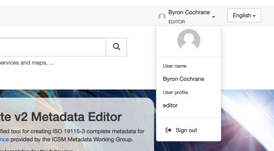
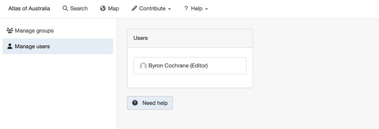
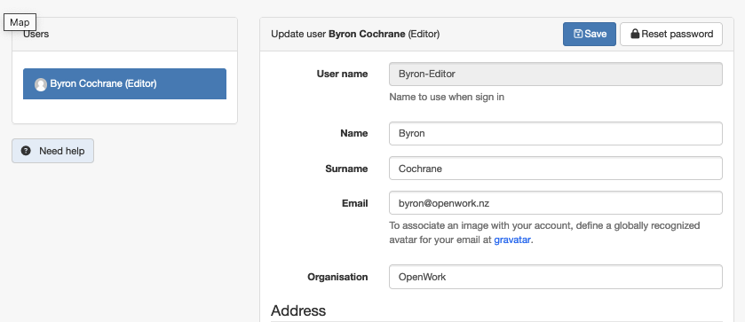
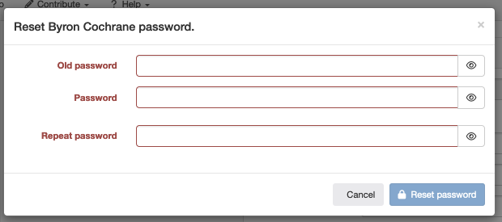

# Change Your Password

To change you password you mist first log in by clicking on *Sign in* and entering your username and password.

>Note - May may also recover a lost account or register a new account here.

Once signed in, *Sign in* in the top menu bar is now replaced with your name and role. 
Click on this to access details or sign out.

Click on your name to access your account.

Now click on your name under *Users* to open your account information.

Here you can edit your account information.
To change your password, click the *Reset password* button in the upper right of this form.
This open a popup window where you can enter your new credentials.

Enter information as indicated and click the *Reset password* button in the Lower right of the form when done.

