# Getting Started 

## Steps
Before using the ANZMetLite v2 metadata editor, a user must first create an account. This can be done by by selecting **Create an account** under the **Sign in** dropdown. 

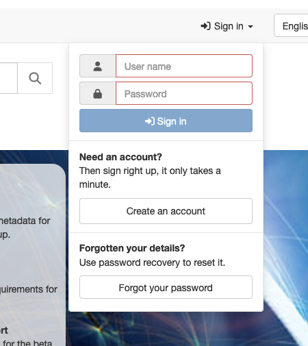

Fill in the form with *Editor* as **Requested profile**. Required fields are **Name**, **Surname**, and **Email**. 

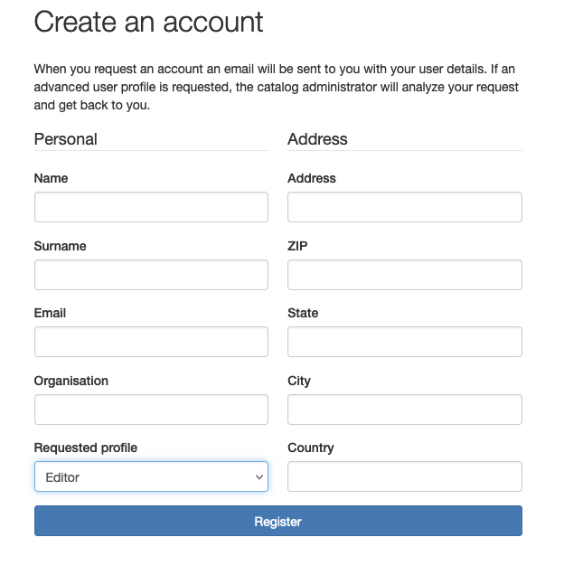

Your email address will become your user name.
You will receive an email containing your new password.
Within one business day, an administrator will enable *Editor* privileges.

It is recommended that you change your password on first log in.

>NOTE: This editor only supports metadata based on ISO 19115-3. It is not designed to support the editing of metadata based on ISO 19139 or the old ANZLIC Profile.

### Step One - Sign in 
1. Sign in by clicking "Sign in" in the toolbar and entering your credentials. 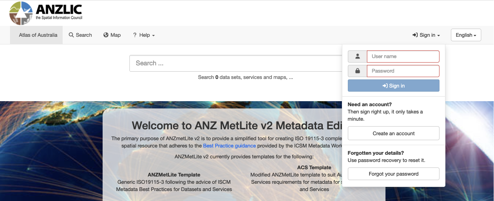

> Note - To change your password or altdr account information, floow the instructions at [*Change Password*](Change-Password.md)
### Step Two - Create a New Metadata Record
1. Under the **Contribute** option in the top toolbar and select **Add new record.** 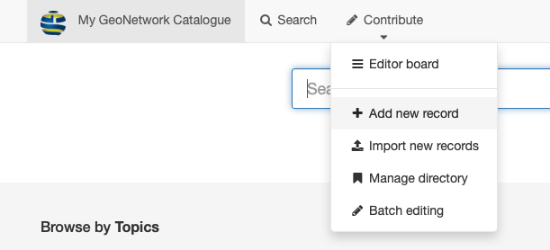
1. A new window will appear where you can find and select your starting template record. 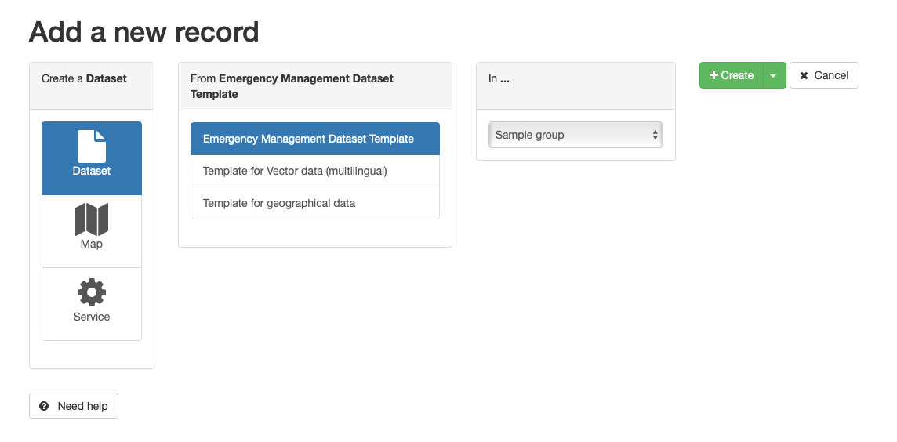
	1. Templates are stored by the types shown in the left hand column. **Dataset** templates will be shown by default.
	1. To select a template for **Service** metadata, select **Service** in the left had column
1. **Select a template** - Select the desired template from the second column.
   > 
	>NOTE: For default  installations, the **ANZMet Lite Dataset Template** should be used for dataset metadata. For service records, the **ANZMet Lite Service Template** should be used. Your administrator may see fit to provide variations of these templates for specific resource metadata.	

1. If you have membership in multiple groups, you can select the appropriate group for this metadata record in the third column.
   
1. **Set Metadata UUID source** - In the fourth column under **Metadata Uniform Resource Name**, you can choose how the metadata URN is provided.
   1. Click the dropdown button under **UUID Source** 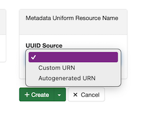
   1. Default value is **Autogenerated URN**. Use this if you wish to use a GeoNetwork supplied URN as the metadata UUID.
   1. Select **Custom URN**. If you wish to use a UUID supplied from a different source, such as ANZLIC ID. 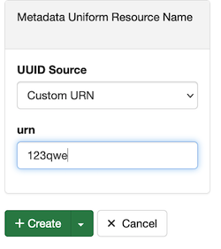
		1. A new text entry box appears labelled **URN**
		1. Enter your custom metadata UUID here,
1. Clinking the green **Create** button at the bottom of the forth column will launch your new metadata record in the _ANZLIC Editor_ window.

### Step Three - Edit Metadata Record
Completion of **Step Two**  opens a new metadata record in the **ICSM** edit view.
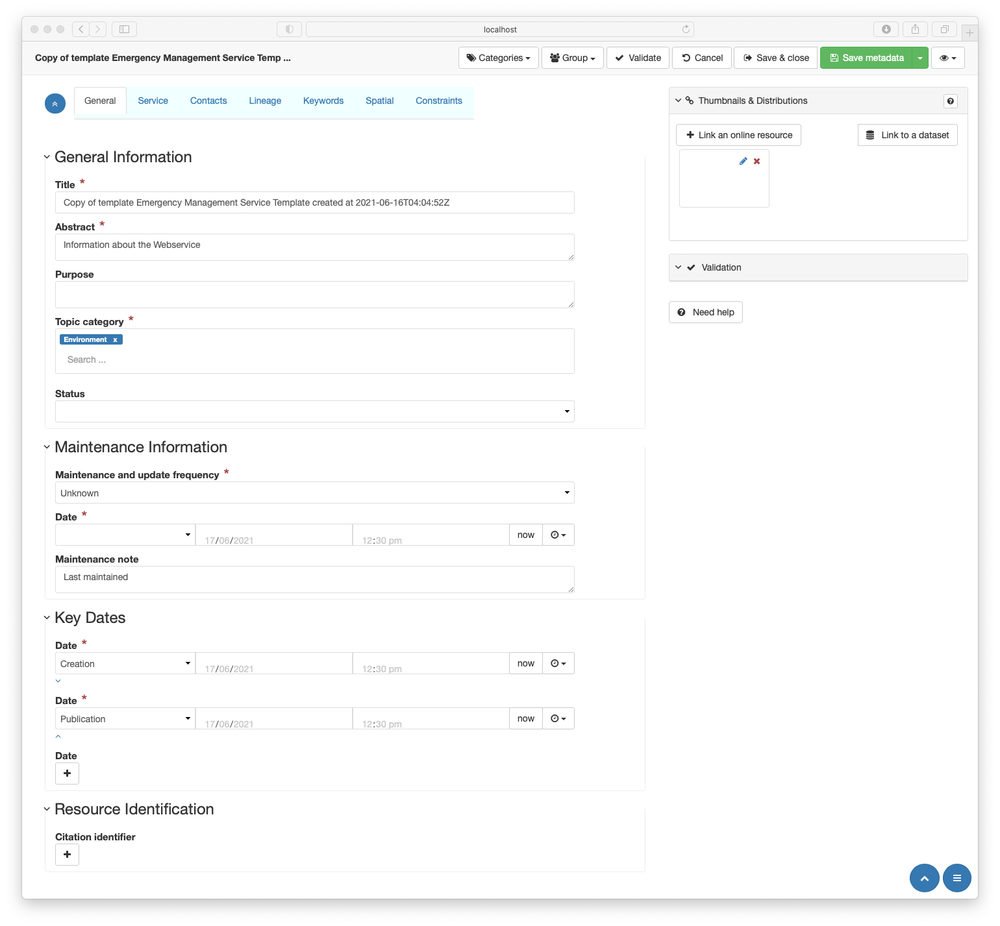
To start editing a metadata record, work through the tabs from left to right. Click on the tab name for further glance.
1. [**General**](,/General-Metadata.md) - General information about the resource 
1. [**Service**](./Service-Metadata.md) - Special metadata related to services. *Visible for service metadata only.*
1. [**Contacts**](./Contacts-Metadata.md) - Information about relevant parties to the resource or metadata
1. [ **Linage**](./Linage-Metadata.md) - Background and provenance information about the resource
1. [**Keywords**](./Keyword-Metadata.md)- Specific search terms by which the resource may be discovered
1. [**Spatial**](./Spatial-Metadata.md) - Includes metadata describing the resource location, reference systems used, and intended scale or resolution
1. [**Constraints**](./Constraints-Metadata.md) - The legal, security and other restrictions that may apply to the resource
1. Editing of a metadata recocord is completed in the sidebar **Thumbnails & Distributions** panel.
  * See [**Thumbnails & Distribution**](./Thumbnails-and-Distributions-Metadata.md) for guidance.

### Step Four - Validate and Save 
1. Click **Save Metadata** in the editor top menu.
1. Click the **Validate** button
	1. This checks the metadata record using XSD and Schematron validation
	1. A set of suggestions to correct any errors appears 
Follow GeoNetwork guidance

#### Assign Category (Optional)
1. Click the **Categories** button in the editor top menu.
1. A list of of categories from which one _Should_ choose that broadly categorises the the resource. 
>NOTE: This is a GeoNetwork provided list that helps with the management of metadata records. The values are stored separately to the ISO19115-3 metadata record.

### Step Five - Save and close
At any point in your edit process you may save and close your edited record> This may be because you are complete with your edits, or you wish to continue editing this record at a later time.
To do so, click the **Save and Close**
* Record is not published 
* Notify your reviewer that the metadata is ready for review.
	* This process may be automated if GeoNetwork workflow tools are enabled 
* Your adminstrator or reviewer will do this

### Step Six - Download Metadata
ANZMetLive v2, while built on GeoNetwork pensource, a complete metadata catalogue, is designed with the express purpose of creating metadata that conforms to ICSM Metadata Best Practicce Guidance. 
Publishing of metadata for discovery by outside parties is not supported.
Metadata creators are expected to download their metadata for publication in other tools.

The procedure for downloading metadata is as follows:

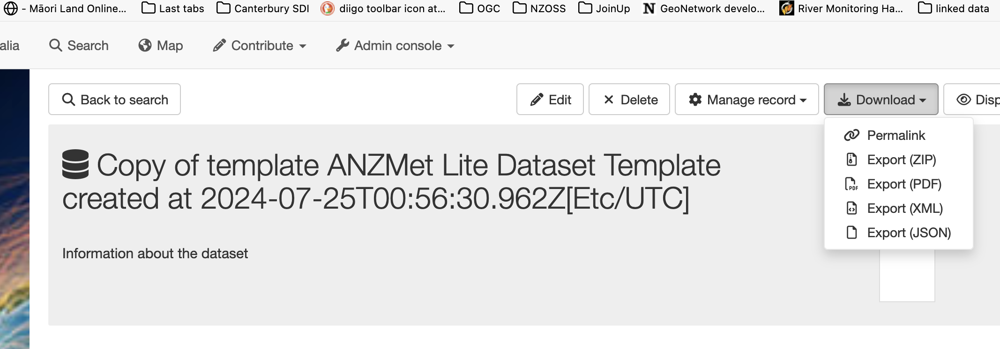

1. Find and select your metadata record for viewing. Click the **Download** tab and select either
   * **Export (ZIP)** to download your metadata with any attacehed resource (thumbnails, etc.) you may have included 
	* **Export (XML)** to download the ISO 19115-3 record only.
1. Optionaly, you may select 
   * **Export (PDF)** to download a PDF version of your metadata or
   * **Export (JSON)** to download a file in schema.org JSON-LD compatible format.
1. The search interface provides additional download options
	1. Export multiple records
		* Filter "Only my records" by selecting this option in the filters as described in **Search for My Metadata** below
		* Click the Check box above the results and select **All**
		* Click selected to view options. Note - Exporting through this menu allows the downloading of multiple records as one package
	   		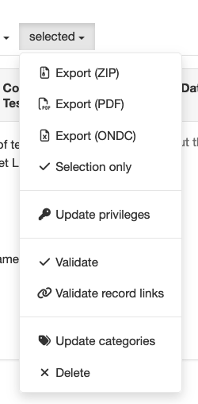
			* **Export (ZIP)** to download your metadata as a collection including any attacehed resource (thumbnails, etc.) 
			* **Export (ONDC)** exports the collected metadata as a csv spreadsheet of metadata according to the ONDC guidance

## Search for My Metadata

It is useful to limit search to one's own records. 
This editor conbtains metadata of many users which may make difficult the finding of one's own previous metadata.
Fortunately is is simple to limit the search to return only those records which you own.

### Editor Board
The easiest way to do this is via the **Editor board** which, by default, limits the records returned to those the logged in editor owns.

1. Click **Contribute** in the top menu bar and select **Editor board**.
  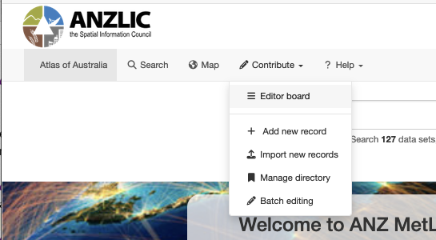

1. The resuls pain will be limited to records you own.
  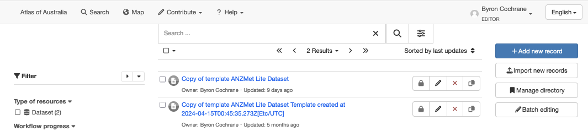
   
### Search Window
1. Access the *Search* window by cliking **Search** in the top toolbar.
1. In the new window, select the three sliders icon to the right of the seach field and icon.
1. Select **Only my records** and click the three sliders icon to dismiss this form
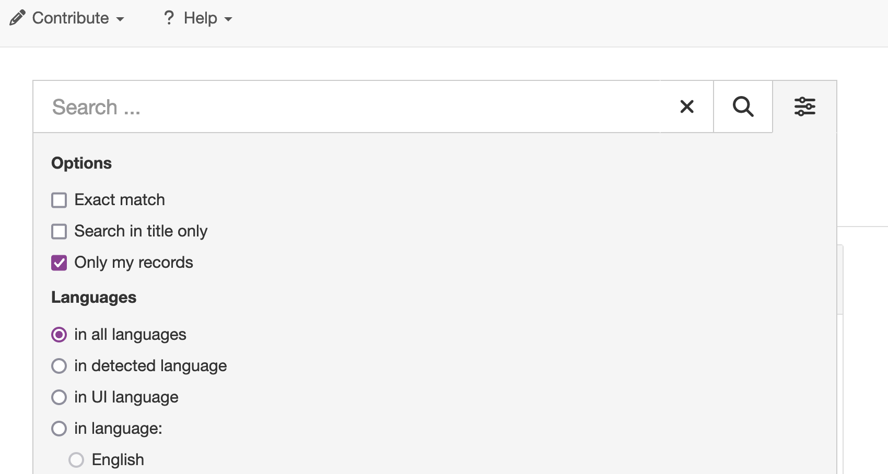
1. Click search. This limits the results to records you created or own
   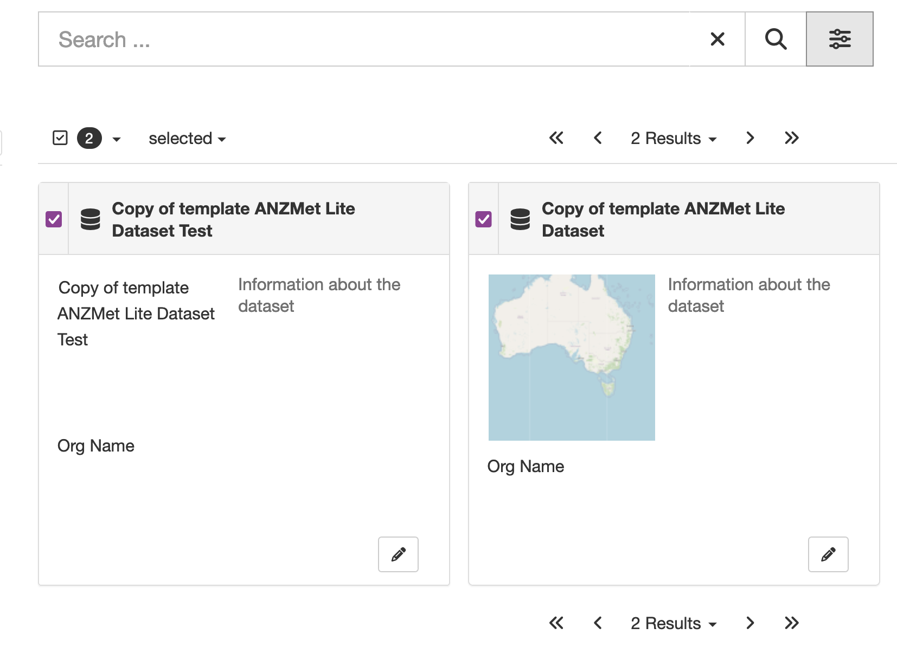
1. These results can be further filtered by using entering terms in the search box and clicking the spyglass icon.

## Upload Metadata
The ANZMetLite v2 may also be used to validate metadata created elswhere. 
Or it may also be used to programatlically convert metadata in the ANZLIC Profile (or other metadata encoded in ISO 19139) to ISO 19115-3:2018.
Once uploaded, ANZMetLite v2 can be used to validate and edit these metadata.
1. Click on **Contribute** tab and select **Import new records**
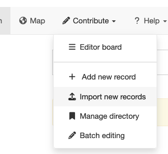
1. In the new form, Drag and drop you metadata record onto the green **Upload to public datastore** bar.
1. Make sure the **Type of record** is *Metadata*
1. **Apply XSLT conversion** should be blank unless
	* You wish to convert a ISO 19139 (or ANZLIC Profile) metadata record
	* In this case, set this field to *schema:iso19115-3:2018convert/fromISO19139*
	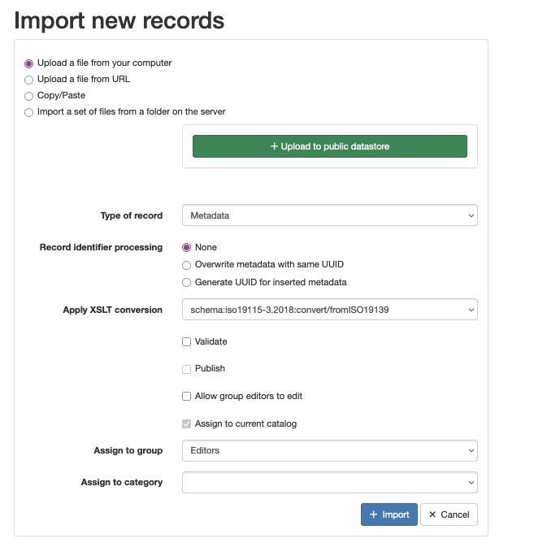
1. Leave other fields as default values
1. Click import. Wait for success message. Now you may search for, select, validate and edit your uploaded metadata.

	

## Getting Help
This help document can be accessed in two ways:
1. Select the **Need Help?** button at the bottom a side panel to open a directory of help pages in a new window,
1. Clicking on most entry tools in the Edirot interface will provide a brief statement about the usage of that entry and a **Help** link to more information.
>NOTE: **Tooltips** mst be enabled in the **View selector**for this behaviour.
    
[**GeoNetwork help**](https://geonetwork-opensource.org/manuals/trunk/en/index.html) is available at https://geonetwork-opensource.org/manuals/trunk/en/index.html.

[**ICSM Best Practice**](https://geonetwork-opensource.org/manuals/trunk/en/index.html) guide for ISO19115-3 metadata is available at https://geonetwork-opensource.org/manuals/trunk/en/index.html

# Navigating the Editing Window

The ANZLIC editing window can be desrcribed as habing four main components:
1. Top toolbar
1. Tabs
1. Body
1. Sidebar

The top toolbar buttons are to be used after metadata is complete. These include:
1. Categories
1. Group
1. Validate
1. Cancel
1. Save & close
1. Save metadata
1. View selector (eye icon)

The use of these buttons is described in [**Getting Started**](#getting-started).

## The View selector

* **Advanced** - This veiw is for advanced users familiar with the metadata standard and GeoNetwork. 
  >NOTE: This view is called _Full_ in standard GeoNetwork installations.
* **XML** - Also for advanced users familiar enough with the ISO 19115-3 standard to work in raw XML.
* **More details** - Please leave unchecked. Advanced users may find this helpful.
* **Tooltips** - This checkbox **Must** be checked to access inline help.

## Tools and Notation 

### General Guidance
* **Mandatory elements** are marked by a red asterisk 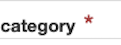
* **Adding elements** or sections can be done with the "+" button 
* **Deleting items** - if a red X 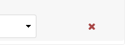 appears to the right of a line, this element may be deleted by clicking the red X
    * _Also applies to sections when allowed_
 ### Editor Data Entry   
Multiple entry types exist in the editor. These include:
* **Text entry** - single line free text entry 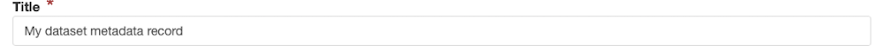
* **Text box** - expandable box for multiline text entry. Can be expanded. 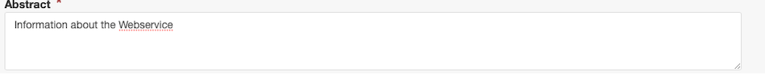
* **Recomendations text field** - Free text with suggested entry values from codelistv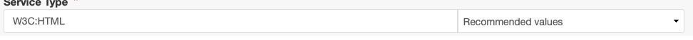
* **Dropdown selector** - to choose a single item from a enumeration or codelist
* **Mutiselector** - to choose a mutilple items from a enumeration or codelist 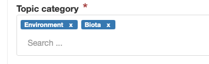
* **Date selector** - to choose dates and times. Appearance may vary depending on your browser. 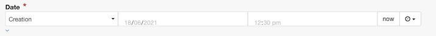

### Custom Data Entry
A small number of customised interfaces have been provided. These are managed Help for these tools is available via the help pages.
* [**Services - Connect point**](./Service-Metadata.html#connect-point) - to add service endpoint parameters
* [**Contact selection**](./Contacts-Metadata.html#using-the-search-for-contact-tool) - Used in multiple locations to populate party information
* [**Keyword selector**](./Contacts-Metadata.md#using-the-keyword-thesaurus-tool) - For selecting keywords from controllrd vocabularies
* [**Reference System selector**](./Spatial-Metadata.html#reference-system) - Used to populated Refernce system metadata from a predefined selection
* [**Constraints selector**](./Constraints-Metadata.html#using-the-constraints-selection-tool) - Used to select and populate legal and security constraints

### Page navigation aids
Useful for longer more complex metadata and small screens where visibility of all elements is difficult.
* 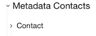 Collapsing and expanding sections is accomplished by clicking the caret at the left of the section name. 
*  Located in the upper left is a double caret in a blue circle. Clicking this collapses and expands all sections on a page.
*  The single caret in the blue circle on the lower left brings you to the top of the page.
*  Also on the lower left is a hamburger menu button in a blue circle. This exposes or hides the sidebar navigator. This consists of a list of all expandable sections in a page. Clicking a section in this sidebar takes one to that section. 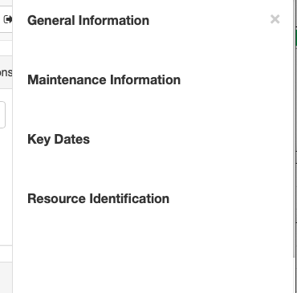

