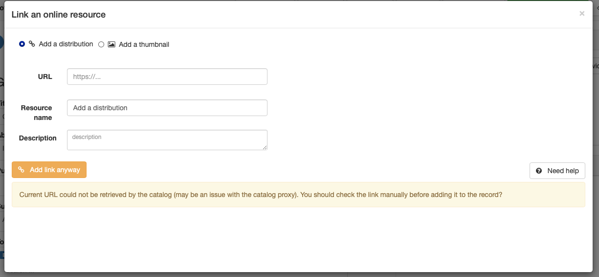
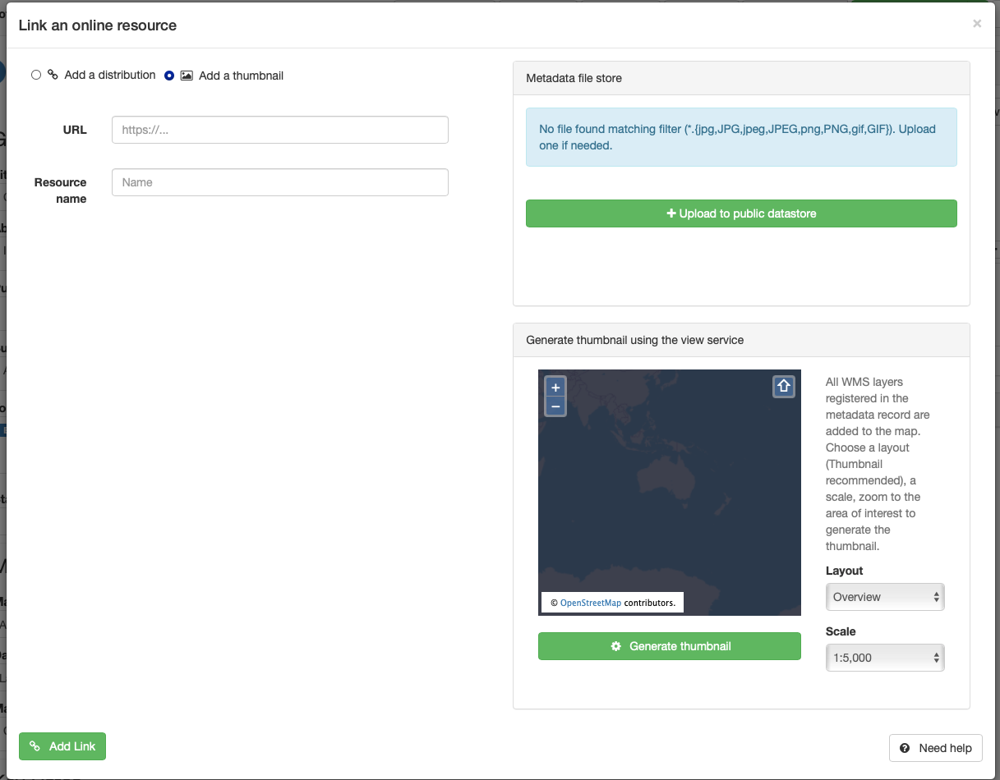

# Thumbnails & Distributions 
After completing the tabs, the next step is to link the metadata to representational images (Thumbnails) and access points (Distributions). 

* The  icon brings you to this page.

## Link to an online resource
The **Link to an online service"* button presents a tool with two useful options to make your metadata more useful:
* **Add a distribution** - provides links for accessing the described resource
* **Add a thumbnail** - provides methods for including representational images to be included with your metadata

### Add a distribution

Selecting the **Add a distribution** radio button presents a simple interface with three fields
* **URL** - This field _Should_ be populated with the web address at which the resource may be obtained. When populated, the green **Add link** button will replace the orange **Add link anyway** button.
>NOTE: The link is only checked for structure. It does not check if the link resolves to a valid endpoint. 
* **Resource name** - This field holds the name that the resource is known by at the endpoint provided
* **Description** - Additional information related to the distribution _Should be entered here.

Once the **Add Link** is selected, the metadata will be& disstrobutionsappended to include this distribution. The distribution will now also appear in the **Thumbnails & Distributions** panel.

>Note: The **Add link anyway** button will also add distribution information to the metadata. This may be useful in cases where distribution by mean other than online may be offered. Consult your administrator.

### Add a Thumbnail
Thumbnail images are useful for providing users a representational image that indicates nature of the resource. Sometimes this may be a sample from the resource. Sometimes a logo may be more appropriate.

Selecting the **Add a thumbnail** radio button presents a new interface. Three separate sections present three different methods by which a thumbnail may be added.
* **URL & Resource name** - Opperates in simalar fashion to **Add a distribution**
    * * **URL** - This field can be populated with the web address a thumbnail may be retrieved. 
    * **Resource name** - This field holds the name by which the image is known 
* **Metadata file store** - Allow the uploading of a chosen image to the GeoNetwork pulic folder for that metadata. Here it can be accessed by anyone with the ability to access the metadata catalogue.
    * **Upload to public datasstore** launches a filebrowser by which you can select the desired image to upload 
    * Multiple files may be loaded in this manner.
* **Generate thumbnail using the view service** - if connected to a mapservice, this widow may be used to generate a thumbnail interactively.
    * If a valid service is added using the adjacent **Link to a service** button as described below, this sevice may be used to create thumbnail images. 
* **Add a link** button in the lower left.
    * Click this button to load your thumbnail images

## Link to a service / dataset 
A **Link to a service** (if editing dataset metadata) or **Link to a dataset** (if editing service metadata) button will present itself in the upper right of the **Thumbnails & Distributions** window.

Clicking this button will present a window whereby exixting metadata records can be linked.

* **Link to a service** presents a list of service metadata from your catalogue to which you can link a dataset metadata record
[Link to a service](./images/LinkToService.png)
    * Select the related service metadata record
    * Click **Add the following link to the dataset (as an online source in the distribution section):** checkbox to include the service in the distrubtions metadata for this resource
    * Click the green **Link to a service** button in the lower left to complete this process
    >NOTE: This dataset metadata will now appear in the reference service metadata record as a **Coupled Resource**

* **Link to a dataset** presents a list of service metadata from your catalogue to which you can link a service metadata record
[Link to a dataset](./images/LinkToDataset.png)
	* Select the related dataset metadata record
	* Click **Add the following link to the dataset (as an online source in the distribution section):** checkbox to include the service in the distrubtions metadata for this resource
	* Click the green **Link to a service** button in the lower left to complete this process
	>NOTE: This dataset metadata will now appear in the reference service metadata record as a **Coupled Resource**

    
